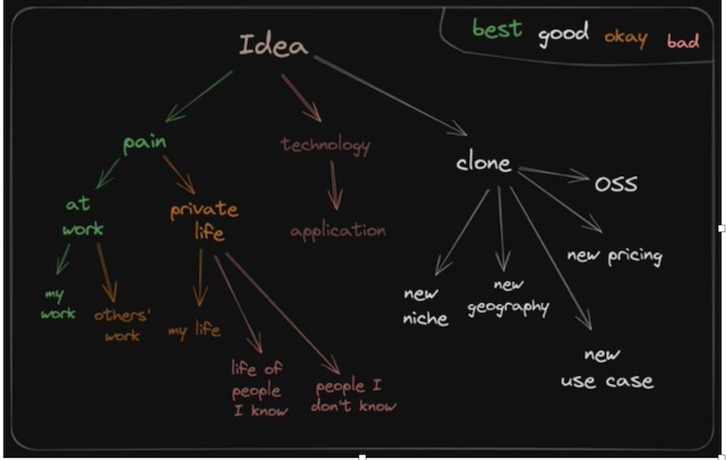

# Building Products with AI
*Published on Feb 1, 2025*

"You need three things to create a successful startup: good people, a product customers want, and minimal expenses." - Paul Graham

## Power to the People

 A solo developer, armed with patience and persistence, launches an AI-driven tool that automates their work, freeing up time while the revenue streams in.

A frustrated creator spends hours sifting through different web documents for insights to create content until a startup builds an AI tool that automates the process.

 A regional business struggles with software that doesn’t support local languages until a freelancer customizes an open-source alternative. 

A small team, just a CEO, CTO, and CFO run a billion-dollar company, powered by AI agents that handle operations, customer support, and even fulfillment.

The secret? Solving real problems efficiently. Experience used to be the bottleneck, but AI closes the gap. Now, anyone with firsthand knowledge of a problem can leverage AI to engineer the solution without years of trial and error. The best ideas don’t appear out of nowhere; they emerge from real pain points, transforming frustration into opportunity. Businesses and individuals are willing to pay for solutions that remove friction, especially when efficiency translates directly into profit.

## Finding Ideas

 
Some of the most impactful innovations don’t require reinvention, just refinement. Technology is a dynamic marketplace, this dynamism creates different ways in which products can be developed, distributed, and embraced by users. 

1. Make It  Free & Open-Source
Certain products derive their strength not from exclusivity or high cost, but from being freely available and open to contributions from a global community. This model fosters widespread adoption, continuous improvement, and a self-sustaining cycle of innovation, what some call a flywheel effect. Take Linux, for instance. Far from a monolithic operating system, Linux powers everything from cloud computing infrastructure to mobile devices and enterprise servers through countless tailored variations like Ubuntu and Fedora. Its open-source nature invites developers worldwide to tweak and enhance it, making it a backbone of modern tech without a single, rigid identity. A security researcher booting up Tails is engaging with a vastly different world than a developer fine-tuning their Arch Linux setup, even though both operate on the same foundation. Browsers too, Firefox, developed by Mozilla, thrives as a privacy-focused web browser thanks to its open-source roots, with volunteers and developers adding features that keep it competitive against giants like Chrome. Safari integrates seamlessly into Apple’s ecosystem. Brave and Tor champion privacy. These differences aren’t just surface-level, they define the experience.

In the creative and productivity spheres, this model shines too. Blender, a free, open-source 3D modeling and animation tool, rivals expensive software like Autodesk Maya, fueled by a passionate community of artists and developers. LibreOffice offers a no-cost alternative to Microsoft Office, while WordPress, another open-source gem, powers nearly half the web with its extensible content management system. Even Android, through its Android Open Source Project (AOSP), exemplifies this approach: while Google layers monetized services atop it, the core OS flourishes because it’s free for manufacturers and developers to adapt. Across tech and creative domains, these examples show how openness can drive adoption and innovation, often outpacing pricier, closed competitors.

2. Offering Affordable Alternatives
Not every product needs to be free to succeed, some carve their niche by offering high-quality alternatives at a fraction of the cost of mainstream options. This approach democratizes access while challenging the dominance of established players. In the creative tech space, Affinity Photo and Affinity Designer provide robust, one-time-purchase alternatives to Adobe’s subscription-based Photoshop and Illustrator, appealing to designers who balk at recurring fees. DaVinci Resolve, with its free tier and affordable paid version, takes on Adobe Premiere Pro in video editing, offering professional-grade tools without breaking the bank.
Beyond creative tools, this strategy spans industries. ProtonMail delivers a privacy-focused email service that’s cheaper than Gmail’s premium offerings, while Notion’s generous free tier competes with Microsoft OneNote and Evernote for note-taking supremacy. In hardware, Xiaomi smartphones pack high-end specs at prices far below Apple or Samsung flagships, proving affordability can coexist with quality. In finance, platforms like Robinhood disrupted traditional brokerages by offering commission-free trading, making investing accessible to a younger, cost-conscious demographic. These products show that affordability can be a powerful differentiator, especially when paired with features that rival or exceed those of pricier competitors.

3. Region-Specific Solutions
Some products succeed by zeroing in on the unique needs of a specific region, its language, regulations, infrastructure, or cultural preferences. These aren’t one-size-fits-all; they’re custom-built for local realities. In China, WeChat transcends the messaging app mold of WhatsApp, integrating payments, social media, and e-commerce into a single “super app” that dominates daily life. Alibaba, another Chinese titan, tailors its e-commerce platform to local businesses and consumers, outmaneuvering Amazon in its home market. Baidu, meanwhile, serves as China’s answer to Google, optimized for the country’s censored internet and linguistic nuances. Elsewhere, regional innovation tackles different challenges. India’s Jio revolutionized mobile access with dirt-cheap data plans, bringing millions online in a price-sensitive market. In Kenya and across Africa, M-Pesa transformed finance for unbanked populations with a mobile money platform that bypasses traditional banking infrastructure. These examples highlight how products can achieve massive impact by solving problems specific to a region, whether that’s affordable connectivity in India, digital payments in Africa, or an all-in-one app in China.

4. Niche-Tailored Products
Some products embrace precision over mass appeal. A product could be repurposed into a laser-focused utility, serving specific industries, niches, professions, or communities. These niche offerings succeed by being the best at what they do for their target audience. Figma, for example, isn’t a general design tool, it’s built for UI/UX designers, with real-time collaboration that Adobe’s broader suite can’t match. Tableau dominates business intelligence with data visualization tools tailored for analysts. In education, Duolingo gamifies language learning for casual students, making it both free and engaging. Fitness buffs find their match in Strava, a social app designed exclusively for runners and cyclists. In finance, platforms like Bloomberg Terminal serve a narrow but lucrative niche: professional traders and analysts who need real-time data and analytics. These products don’t aim to please everyone, they win by being indispensable to someone.

The days of a few dominant players dictating how products are made and consumed are fading. Today’s landscape is a mosaic of strategies: open-source dynamos like Linux and Blender harness community energy, affordable disruptors like Xiaomi and Affinity Photo challenge the premium status quo, regional champions like WeChat and M-Pesa address local needs, and niche tools like Figma and Tableau perfect their craft for specific users. Across tech, finance, education, and beyond, these examples reveal a truth: there’s no single path to success. Products thrive by finding their unique fit, whether that’s free and open, cheap and accessible, locally attuned, or precisely tailored. In this fractured ecosystem, diversity isn’t just a byproduct, it’s the engine of progress.

AI is reaching this same inflection point. DeepSeek R1’s success signals that the model itself is no longer the sole focus. The true value lies in the app layer, the interface, experience, and workflow that bring AI to life. Take Perplexity AI, for example. It doesn’t just demonstrate the raw capabilities of large language models; it refines them into an intuitive, research-driven assistant. This isn’t just about building better models, it’s about crafting the experiences that define how AI fits into our lives.

I haven’t yet cracked the code of product-market fit, but I’m on a mission to get there. Inspired by the success of Perplexity AI, I’m building Syntext, a tool that can potentially build on LLM capabilities with a practical, user-focused design. LLM isn’t just a buzzword here; it’s an assistant that summarizes, analyzes, explains, rephrases, and creates, unlocking insights from PDFs, videos, niche document formats, web, all in one seamless experience. My goal is clear: create a product so useful that people will pay for it, validated by reaching 50,000 users. I’ve already built a landing page to explain its value, an interface to ingest documents, and a system to extract information. Now, it’s about refining this foundation into a scalable, profitable solution.

## SyntextAI
<iframe width="760" height="515" src="https://www.youtube.com/embed/4oy5PdsxI4E" frameborder="0" allow="accelerometer; autoplay; encrypted-media; gyroscope; picture-in-picture" allowfullscreen></iframe>

## Solving Problems with  AI, Data, and UX
Building Syntext isn’t about chasing tech trends, it’s about solving real problems with speed, simplicity, and scalability. I’m not over-engineering from the start; instead, I’ve launched a prototype to gather feedback and iterate based on what users actually need. The core functionality is straightforward: upload a document, ask a question, get an answer with clear source attribution. No bells and whistles, just results. I chose React for the front end and Python for the backend because they’re efficient, widely understood, and future-proof, ensuring I can attract talent as the product grows.

The user experience is everything. The landing page is clean and direct: a bold explanation of Syntext’s value and a “Sign in with Google” button for instant, trusted access, no forms, no friction. Inside the app, usability drives every decision. When you upload a file, it glows red while processing, then turns green when ready, simple, visual cues that keep you informed. The interface sticks to familiar patterns, tabs, buttons, forms. This feels intuitive across devices. Real-time feedback, like disabling the input field during queries, guides users through a smooth, turn-by-turn interaction. This isn’t just UI, it’s about minimizing frustration and maximizing control, ensuring the tool feels effortless.

Scalability matters too. Processing a file or generating an answer isn’t instant, it can take seconds or minutes, so I’ve opted for long polling over complex WebSockets. The user uploads a document, the backend crunches it, and the front end checks in periodically until it’s done. It’s simple, effective, and keeps costs low while delivering a smooth experience. This balance of speed and practicality is key to making Syntext a tool people rely on daily. 

## The Road to 50,000 Users: Monetization Without the Hassle
A great tool isn’t enough it has to sustain itself. Storing files and running AI isn’t cheap, so monetization is baked into the plan. The settings page integrates Stripe for seamless payments: a few clicks to subscribe, no redirects, no fuss. Free tiers hook users with basic access, while premium features, like faster processing or broader file support, unlock with a plan. It’s not about forcing payment; it’s about making it so natural that users who see the value don’t hesitate. Stripe handles trials, upgrades, and recurring billing, letting me focus on the product, not the payment plumbing.
Syntext’s success isn’t about perfection out of the gate, it’s about iteration. The MVP is live, and now it’s time to listen. Feedback will shape the next steps: maybe users crave content generation first, or perhaps Excel integration is the killer feature. Discoverability is my next hurdle. Tackling SEO and understanding the right search terms to get customers to pull in the right crowd. Every tweak brings me closer to a product that’s not just useful but worth paying for. AI is my co-founder here, together we can build a business that solves user needs as its understanding of language and reasoning capabilities improve.  It’s the UX/UI template, paired with smart data handling, that will turn Syntext into a must-have. I’m not building a toy; I’m crafting a solution. If I can solve this problem for 50,000 people and make it scalable, simple, and profitable, it could be more than an idea. It’ll be a product that sticks.
At its core, delivering effective AI is strictly about the right data in the prompt. The front end is where this journey begins: an upload zone makes ingestion painless, while a query bar lets users ask natural-language questions. Behind the scenes, AI extracts and indexes the content, but the magic happens in how it’s presented, clear, concise responses tied to exact sources. For now, it’s PDFs, but I’m designing a template UX/UI that can flex to handle videos, Excel files, and more, AI works when the right data is provided. 

[SynTextAI GitHub Repository](https://github.com/Sarsue/SynTextAI)
