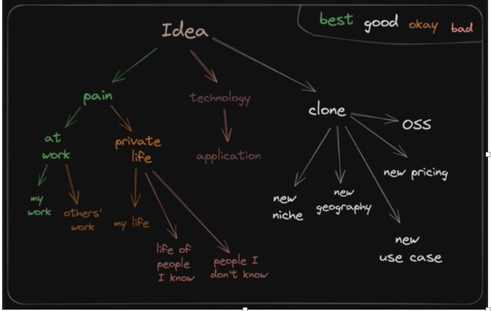

# Building Products with AI
*Published on Feb 1 , 2025*

"You need three things to create a successful startup: good people, a product customers want, and minimal expenses." - Paul Graham

## Getting Started 

A front-end engineer spins up a backend service in minutes, deploys it, and watches real-time analytics roll in—no waiting for a specialized team. A solo developer, armed with patience and persistence, launches an AI-driven tool that automates their work, freeing up time while the revenue streams in.

A frustrated operations manager spends hours sifting through disorganized data—until a startup builds an AI tool that automates the process. A regional business struggles with software that doesn’t support local languages—until an entrepreneur customizes an open-source alternative. 

A small team—just a CEO, CTO, and CFO—runs a billion-dollar company, powered by AI agents that handle operations, customer support, and even code generation.

The secret? Solving real problems efficiently. Experience used to be the bottleneck, but AI closes the gap. Now, anyone with firsthand knowledge of a problem can leverage AI to engineer the solution—without years of trial and error. The best ideas don’t appear out of nowhere; they emerge from real pain points, transforming frustration into opportunity. Businesses and individuals are willing to pay for solutions that remove friction, especially when efficiency translates directly into profit.

## Finding Ideas

 Some of the most impactful innovations don’t require reinvention—just refinement. A product gains value when it’s open-source, more affordable, region-specific, or tailored to a niche. Technology has always evolved around choice. Operating systems, once a rigid battle between Windows and macOS, have fractured into ecosystems tailored to diverse needs. Linux, the backbone of cloud computing, mobile devices, and enterprise servers, doesn’t exist as a singular experience—it manifests in countless variations, each optimized for a specific user.

A security researcher booting up Tails is engaging with a vastly different world than a developer fine-tuning their Arch Linux setup, even though both operate on the same foundation. The same holds true for browsers: Chrome prioritizes speed, Safari integrates seamlessly into Apple’s ecosystem, Brave champions privacy,  Tor too. These differences aren’t just surface-level—they define the experience.

AI is reaching this same inflection point. DeepSeek R1’s success signals that the model itself is no longer the sole focus. The true value lies in the app layer—the interface, experience, and workflow that bring AI to life. Take Perplexity AI, for example. It doesn’t just demonstrate the raw capabilities of large language models; it refines them into an intuitive, research-driven assistant. This isn’t just about building better models—it’s about crafting the experiences that define how AI fits into our lives.

Inspired by the success of Perplexity AI, I want to build Syntext—a powerful AI search tool designed to go beyond the web. The goal is simple: make it seamless to search PDFs, videos, niche document formats, and the web, all in one place. Whether it’s research papers, technical manuals, or multimedia content, Syntext should be able to find answers wherever they exist.
Building products with AI is easier than ever, but real success comes from utility and adoption. If I can get 50,000 users, that’s success. That’s proof that this kind of search tool is needed. Now, it’s just a matter of building it.

## SyntextAI

<iframe width="760" height="515" src="https://www.youtube.com/embed/4oy5PdsxI4E" frameborder="0" allow="accelerometer; autoplay; encrypted-media; gyroscope; picture-in-picture" allowfullscreen></iframe>

## User Centred Design 
Building SyntextAI isn’t about over-engineering from day one—it’s about moving fast, keeping it simple, and ensuring it scales when the time comes. The first step is speed: getting a working prototype out the door, gathering real-world feedback, and refining based on actual user needs, not assumptions. Simplicity drives the core functionality—process documents, handle queries, and return answers with proper source attribution. No fluff, just results. But simplicity doesn’t mean short-sightedness. Scalability is baked into the foundation, choosing React and Python not just for their efficiency, but because they attract skilled developers who can contribute as the product grows. Even the LLM itself is fluent in these languages, making integrations smoother. The goal is clear: ship fast, solve real problems, and build something that lasts.

When designing a successful product, the foundation starts with the design—everything else, from backend code to marketing, follows from there. First and foremost, the front-end experience shapes how users interact with the app. It’s crucial to focus on how data gets into our system, ensuring the process is smooth, intuitive, and user-friendly. The user’s journey through the app needs to be seamless—whether they’re navigating or entering information—minimizing friction at every touchpoint. We need to think beyond just the user interface and focus on the overall experience: how easy is it for a user to accomplish their goals? Is the app intuitive, with clear directions and support when needed? From there, we look at discoverability—how will users find the app? What search terms or pain points will drive them to our solution? By addressing these factors thoughtfully and thoroughly, we ensure that the app is not only functional but also easy to use, and positioned to attract the right users before we even begin worrying about backend infrastructure.

As an aspiring designer, I focused on several key principles to guide the design process and create an intuitive user experience. Usability and accessibility were my top priorities, ensuring that users could navigate the app with minimal cognitive load. For instance, when a file is uploaded, it appears in red, signaling that Syntext is processing it. Once it's ready for responses, it turns green—providing clear, immediate feedback. To enhance usability, I maintained consistency by using familiar UI patterns like tabs, buttons, and forms, helping users feel at ease across different platforms. I also emphasized interaction clarity by incorporating real-time affordances—such as disabling the input screen while a query is being processed, enforcing a structured, turn-by-turn conversation. These design choices ensure users feel in control, reducing frustration and making the experience seamless.

1. **Landing Page with Google Authentication**  
   A visitor lands on the page, no clutter, no distractions—just a clear, compelling message about what SyntextAI does. A single button: “Sign in with Google.” No lengthy forms, no forgotten passwords, just instant access. It’s familiar, it’s secure, and it signals trust. The same way a blue checkmark on Twitter reassures legitimacy, authentication through Google or Microsoft Entra ID tells users this isn’t some fly-by-night project. It’s built for real work, designed for professionals, and ready to scale. The landing page isn’t just an entry point—it’s the first marketing asset, the first trust signal, the first conversion.

2. **Core Functionality**  
 Every decision in building Syntext is a trade-off between simplicity, scalability, and user experience. The current version supports PDF search however other file formats and web search will be added over time. 
In Syntext’s architecture, real-time feedback is essential, but complexity must serve a purpose. When a user uploads a file, the system needs to process it asynchronously—sometimes taking several seconds or minutes. Similarly, generating a well-researched AI response isn’t an instant  (synchronous) operation. These workflows don’t fit the typical request-response model of REST APIs.

A WebSocket or Server-Sent Events (SSE) connection could keep users updated in real time, but each approach comes with connection management overhead. Instead of introducing unnecessary complexity, Syntext uses long polling—a simple yet effective way to bridge the gap.

Here’s how it works:

User submits a request – Whether it’s file processing or a query requiring deeper analysis, the request is logged.
Backend starts processing – The system extracts, indexes, or retrieves relevant data while keeping track of progress.
Client polls for updates – Instead of keeping a persistent connection open, the frontend periodically asks for the latest status.
Server responds when ready – If results are available, they’re returned immediately. If not, the request waits briefly before returning an update, reducing unnecessary polling cycles.

This method keeps the architecture simple while ensuring a smooth user experience. There’s no need for clients to manage open connections, and scaling remains straightforward. The priority is to ship fast, validate, and iterate, rather than over-engineering solutions prematurely. Long polling makes modern REST APIs work for scenarios that demand extended processing times—without adding unnecessary infrastructure complexity.

Adaptive Retrieval for RAG: Context-Aware Chunking
Rather than rigid, fixed-size chunks, Syntext structures retrieval around natural linguistic and conceptual boundaries within documents. For PDFs, this means segmenting by sentences, concepts, or logical sections instead of arbitrary tokens.

Every additional piece of context passed to the model increases both bandwidth usage (network traffic) and processing costs (token consumption), making optimized retrieval essential for scalability and efficiency. Large context windows mean more data transfer, higher token counts, and increased response latency, all of which drive up costs and slow user experience. Instead of sending entire pages, we retrieve only the most relevant segment based on semantic similarity, expanding just enough to preserve meaning without overwhelming the model. Reranking and filtering ensure only the most useful snippets are used, reducing unnecessary token usage while maintaining accuracy. This approach strikes the right balance between relevance, cost, and performance—keeping Syntext scalable, responsive, and cost-efficient while ensuring AI-powered search delivers high-quality results.
More coherent responses by keeping relevant information intact.
Fewer hallucinations since retrieval aligns with how documents are structured.
Optimized cost-efficiency by only passing necessary context to the model.
This same principle extends beyond PDFs—video, spreadsheets, and other formats can be segmented around meaningful units (e.g., speaker turns, table rows).

3. **Settings Page with Stripe Integration**  
When running a business that leverages advanced technologies like LLMs (Large Language Models), the cost of storing files and processing data can quickly add up. However, monetization is essential for sustainability. The goal is to offer a service that provides value to users, and when they recognize that value, they’re ready to subscribe.

Payment shouldn’t be a barrier or an afterthought. It should be an integrated, frictionless part of the user experience. With platforms like Stripe, users can effortlessly complete their transactions in just a few clicks, unlocking their access to the service. There are no clunky redirects, no hidden fees, just a smooth, secure process. This seamless payment experience fosters trust, as users feel comfortable entering their card details, knowing their information is handled securely.

Whether it’s managing recurring billing, offering trials, or handling upgrades, Stripe makes it all easy. Monetization isn’t just about asking users to pay; it’s about making payment so natural and simple that it never feels like an obstacle. It should feel like an extension of the experience, not something that interrupts it. This approach ensures that users who see the value in your product can act on it right away, without unnecessary barriers.

## Agents = Models using Software and Tools
At its core, an AI agent is simply orchestrating models and tools to accomplish tasks. The intelligence of an agent isn’t just in the model itself but in how well it interacts with external tools to retrieve, process, and generate responses. A chatbot, for example, isn't inherently useful unless it can access relevant data, perform searches, or manipulate information effectively.

This is the next frontier for Syntext: expanding the range of tools available to the agent. Right now, it can search and analyze PDFs, but to become truly indispensable, it needs to handle more. The vision is to integrate:

Web Search – Extending responses beyond uploaded documents to include real-time information from the internet.
Video Search – Extracting insights from video transcripts and captions.
Excel & Databases – Querying structured data directly, making AI useful for business intelligence and analytics.
Other Document Formats – Supporting Word documents, PowerPoints, and niche industry formats.
The mission is to achieve the right balance of speed, simplicity, and scalability while building a profitable product. AI should feel effortless to use, fast enough to be practical, and scalable enough to serve thousands—ultimately reaching 50,000 customers.

Instead of spending months perfecting every detail, the priority is rapid validation. By leveraging existing tools like Google Auth and Stripe, Syntext can focus on delivering immediate value and iterating based on real-world feedback.

The MVP is live. The next phase is about gathering feedback, refining the user experience, and expanding capabilities based on demand. Success in AI isn’t about perfection—it’s about iteration, testing, and solving real problems.

Building products with AI isn’t just about speeding up development—it’s about creating a smart, adaptive workflow that aligns with user needs, optimizes resources, and enables rapid experimentation. This is what makes AI products successful: a relentless focus on usability, efficiency, and practical solutions. 

[SynTextAI GitHub Repository](https://github.com/Sarsue/SynTextAI)
